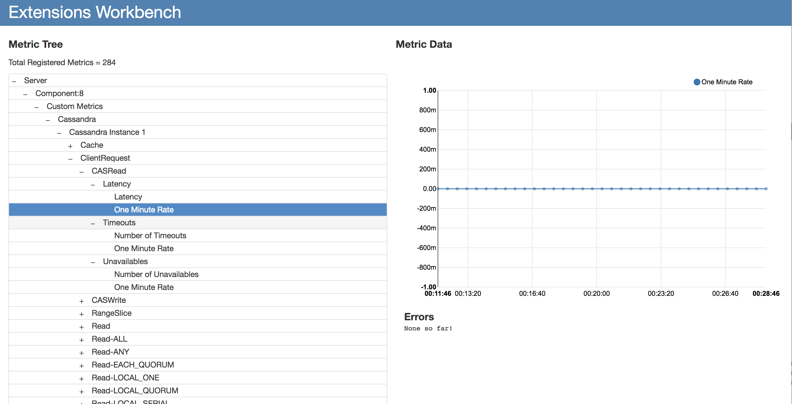

Java SDK for AppDynamics Monitoring Extensions
================================================

AppDynamics platform can be extended to support custom metrics by using [AppDynamics Monitoring Extensions](https://docs.appdynamics.com/display/LATEST/Extensions+and+Custom+Metrics). 
This Java SDK abstracts out common extension features and makes extension development streamlined.

# Release Notes
All the changes to the SDK are tracked in the [CHANGELOG.md](CHANGELOG.md).

# Getting Started

## Extension Prerequisites
Before developing a new extension, check if an AppDynamics supported extension already exists on the [AppDynamics Exchange](https://www.appdynamics.com/community/exchange/).
AppDynamics monitoring extensions extend the [AppDynamics Server Infrastructure Agent (SIM)](https://docs.appdynamics.com/display/LATEST/Server+Visibility) or [Standalone Machine Agent](https://docs.appdynamics.com/display/LATEST/Standalone+Machine+Agent) functionality to report additional metrics to the AppDynamics Controller. 
Please go over the [Extension Prerequisites Guide](https://community.appdynamics.com/t5/Knowledge-Base/Extensions-Prerequisites-Guide/ta-p/35213) for more details on the supported configurations. 

## Importing the Dependency

### Maven
```
<dependency>
  <groupId>com.appdynamics</groupId>
  <artifactId>appd-exts-commons</artifactId>
  <version>2.2.0</version>
</dependency>
```


## Usage

### monitor.xml
Every monitoring extension should ship with a `monitor.xml`. The Machine Agent loads the 
extension jar during its start up and schedules the extension to run based on `execution-frequency-in-seconds` defined in the `monitor.xml`. 
The `monitor.xml` should also point to a `config.yml`. Below is a sample `monitor.xml` 

```
<monitor>
    <name>ExtensionStarter</name>
    <type>managed</type>
    <description>Starter template to gather data from an http source</description>
    <monitor-configuration>
    </monitor-configuration>
    <monitor-run-task>
        <execution-style>periodic</execution-style>
        <execution-frequency-in-seconds>60</execution-frequency-in-seconds>
        <name>ExtensionStarter Monitor Run Task</name>
        <display-name>ExtensionStarter Task</display-name>
        <description>ExtensionStarter Task</description>
        <type>java</type>
        <execution-timeout-in-secs>120</execution-timeout-in-secs>
        <task-arguments>
            <argument name="config-file" is-required="true" default-value="monitors/ExtensionStarterMonitor/config.yml" />
        </task-arguments>
        <java-task>
            <classpath>extensions-starter.jar</classpath>
            <impl-class>com.appdynamics.extensions.extensionstarter.ExtStarterMonitor</impl-class>
        </java-task>
    </monitor-run-task>
</monitor>
```

For more details on monitor.xml, refer to: [Creating monitor.xml](https://docs.appdynamics.com/display/PRO45/Build+a+Monitoring+Extension+Using+Java#BuildaMonitoringExtensionUsingJava-create_mon_xmlCreatemonitor.xml).
### config.yml
Every monitoring extension should ship with a `config.yml`. This file should define the configuration of the extension artifact.
In addition to the configuration, the SDK reads the `config.yml` to load and initialize all the different features mentioned [below](#Features).
  

### metrics.xml
This is an optional file to define the metrics and their properties for a given extension artifact. More about metrics.xml in [Metric Validity, Metric Types, Metric Transformers](#Metric Validity,Metric Types,Metric Transformers) section below.

A new extension should be developed by extending the ABaseMonitor class. For eg. 

```
public class SampleMonitor extends ABaseMonitor {
 
  protected abstract String getDefaultMetricPrefix(){
      return "Custom Metrics|Sample Monitor"
  }
 
  public abstract String getMonitorName(){
      return "Sample Monitor"
  }
 
  protected void doRun(TasksExecutionServiceProvider tasksExecutionServiceProvider){
      //...logic to add the core logic for the SampleMonitor
      List<Metric> metrics = Lists.newArrayList();
      metrics.add(new Metric("HeartBeat", String.valueOf(BigInteger.ONE), getDefaultMetricPrefix() + "|HeartBeat", "AVG", "AVG", "IND");
      tasksExecutionServiceProvider.getMetricWriteHelper().transformAndPrintMetrics(metrics);
  }
 
  protected abstract List<Map<>> getServers(){
      //configuration for multiple servers to be processed in parallel
 
  }
 
}
```


For more details on how to use this Java SDK to build an AppDynamics extension, please check [Extension Starter project](https://github.com/Appdynamics/extension-starter)

# Features

## Metric Validity, Metric Types, Metric Transformers

#### Metric Validity
The following metric validation checks of the metric path and metric value are performed for every metric published using the SDK

1. A metric value should be a positive integer. 


#### Metric Types
The extension developer needs to configure the metric qualifiers for each metric that needs to be reported to the controller. These qualifiers determine how each metric is aggregated and rolled up over time and cluster dimensions.
These qualifiers are classified as  

**aggregationType:** If the extension runs multiple times in 1 min, the Machine Agent aggregates the data points to be sent to the controller. The developer can control how those data points are aggregated into a single datapoint, where the datapoint will be displayed on the metric browser at 1 minute granularity.
Possible values are AVERAGE, SUM and OBSERVATION

**timeRollUpType:** This qualifier allows the developer to decide how the data points are represented when metrics at 1-min resolution are rolled-up to 10-min resolution, and how the metrics at 10-min resolution are rolled up at 60-min resolution.
Possible values are AVERAGE, SUM and CURRENT

**clusterRollUpType:** The cluster-rollup qualifier specifies how the controller aggregates metric values from individual nodes in a tier.
Possible values are INDIVIDUAL and COLLECTIVE


These qualifiers can be set for every metric in the `metrics.xml` or `config.yml`. The default metric qualifier, if not specified in the extension configuration is  `aggregationType=AVERAGE, timeRollupType=AVERAGE, clusterRollupType=INDIVIDUAL`. 

For more details on Metric Qualifers, refer to [Metric Qualifiers]().

#### Metric Transformers
The SDK provides an automated utility that allows extensions developers to transform a metric name and value as it would be represented in the Metric Browser. These transformers include the following: 

**Alias:** Often, metrics are represented by ambiguous names in the artifacts being monitored. The Alias transform can be used to replace a metric’s name.

**Multiplier:** The Multiplier transformer can be used to multiply the original metric value by a factor configured.

**Delta:** This transformer compares the value of a metric at minute X with its value at minute X-1 and publishes the difference as a metric value. Note: The first value will not be reported if delta is true. 

**Convert:** The Convert transformer can be applied to metrics that return a text value from an artifact’s API. These text values can be represented as numeric values.

When MetricWriteHelper.transformAndPrintMetrics() is called, transformers applicable to every metric will be applied.  

For more details on metric transformers, check [Metric Transformers]().

## Metric Path CharSequence Replacement

## Encrypting Clear Text Passwords
The SDK provides a mechanism to encrypt clear text passwords that need to be defined in the `config.yml`. 
To encrypt a password using an `encryptionKey`, run the following command using the extension's jar

```
java -cp <monitoring-extension.jar> com.appdynamics.extensions.crypto.Encryptor <encryptionKey> <clearTextPassword>
```  
The `encryptedPassword` produced using the above command along with the `encryptionKey` needs to be defined in the `config.yml`.

```
encryptedPassword: 
encryptionKey: 
```

The extension developer should use the following api to decrypt an encrypted password by adding the `encryptionKey` and `encryptedPassword` to the Map.

```
CryptoUtil.getPassword(Map)
```

For more details on password encryption, please check [How do I use Password Encryption with Extensions](https://community.appdynamics.com/t5/Knowledge-Base/How-do-I-use-Password-Encryption-with-Extensions/ta-p/29397)


## HTTP Client

The SDK automatically configures an HTTP Client based on the `servers` section in the `config.yml`.

```
servers:
  - uri: ""
    username: ""
    password: ""
    encryptedPassword: ""

    # Uri is preferred instead of host-port-useSsl combo.
  - host: "" # Avoid this, use uri instead
    port: "" # Avoid this, use uri instead
    useSsl: false # Avoid this, use uri instead.
    username: ""
    password: ""
    encryptedPassword: ""
```    

This HTTP Client is available to be used by the extension developer via

```
ABaseMonitor.getContextConfiguration().getContext().getHttpClient()
```

Different settings related to the HTTP Client like SSL Certificates, Authentication, Proxy can be configured in the following manner in the `config.yml`.
    
```
connection:
  socketTimeout: 3000 # Read Timeout
  connectTimeout: 1000
  sslProtocols: ["TLSV1.2"] # Defaults to "default"
  sslCertCheckEnabled: true
  sslVerifyHostname: true

  # This need not be exposed to user. Should be used on a need basis
  sslCipherSuites: [] # Defaults to "default"

  sslTrustStorePath: "" # If not set, defaulted to machine-agent/conf/extensions-cacerts.jks. The prop "-Dappdynamics.extensions.truststore.path=/path/cacerts" takes precedence if set
  sslTrustStorePassword: ""
  sslTrustStoreEncryptedPassword: ""

  sslKeyStorePath: "" # If not set, defaulted to machine-agent/conf/extensions-clientcerts.jks. The prop "-Dappdynamics.extensions.keystore.path=/path/clientcerts" takes precedence if set
  sslKeyStorePassword: ""
  sslKeyStoreEncryptedPassword: ""

  enableCookies: false #Defaults to false
  enablePreemptiveAuth: true

proxy:
  uri: ""
  username: ""
  password: ""
  encryptedPassword: ""
```

For more detailed explanation on HTTP Client, refer to [HTTP Client]().

## Controller Info
The SDK automatically pulls the Controller information and builds a ControllerInfo object which is made available to the extension developer via
```
ABaseMonitor.getContextConfiguration().getContext().getControllerInfo()
```

The controller information can also be provided in the `config.yml`

```
controllerInfo:
    controllerHost: ""
    controllerPort: ""
    account: ""
    username: ""
    password: ""
    encryptedPassword: ""
    encryptionKey: ""
    controllerSslEnabled: ""
    enableOrchestration: ""
    uniqueHostId: ""
    accountAccessKey: ""
    machinePath: ""
    simEnabled: ""
    applicationName: ""
    tierName: ""
    nodeName: ""
```

The ControllerInfo object is built by loading the properties from the following sources in the following order
1. controller-info.xml
2. System Properties
3. config.yml

For more details on ControllerInfo, check [How do I auto upload dashboards from Extensions]().

## Auto Upload Custom Dashboards

The SDK supports automatic upload of a pre-built dashboard to the controller. The dashboard template should be provided to the extension through the `customDashboard` section
in the `config.yml`. The template can be updated and more data can be added to increase the visibility of the metrics provided by the extension. 
For enabling auto upload of custom dashboards, the following configuration needs to be defined in the `config.yml`.

```
customDashboard:
    enabled: true
    dashboardName: "Custom Dashboard"
    pathToSIMDashboard: "monitors/<ExtensionName>/simDashboard.json"
    pathToNormalDashboard: "monitors/<ExtensionName>/normalDashboard.json"
    periodToCheckDashboardPresenceInSeconds: 300
    sslCertCheckEnabled: false
```

For more details on this feature, check [Uploading Dashboards automatically with AppDynamics Extensions]().


## Derived Metrics

Derived metrics are the metrics that can be created using existing metrics by applying a math formula.
Derived metrics can also be used to create rolled-up metrics at any level in the metric tree.
The SDK automatically starts emitting out the derived metrics defined in the `config.yml`. The following configuration needs to be defined in the `config.yml`

```
derivedMetrics:
   - derivedMetricPath: "{x}|Queue|{y}|Cache ratio"
     formula: “{x}|Queue|{y}|Cache hits / ({x}|Queue|{y}|Cache hits + {x}|Queue|{y}|Cache misses)”
   - derivedMetricPath: “RolledUp|Total ops"
     formula: “{x}|Total ops”
     aggregationType: “SUM"
     timeRollUpType: “SUM"
     clusterRollUpType: “COLLECTIVE”
  - derivedMetricPath: “{x}|Queue|Server Total ops”
    formula: “{x}|Queue|{y}|RAM ops + {x}|Queue|{y}|hdd ops"
``` 

For more information on derived metrics, check [Derived Metrics Calculation](https://community.appdynamics.com/t5/Knowledge-Base/What-are-the-Derived-Metrics-Calculator-and-Cluster-Metrics/ta-p/29403).


## Events Services

AppDynamics Metric Browser supports numerical values only.In order to make use of AppDynamics platform efficiently, the Events Service client from the SDK can be used.
The Events Service client uses the AppDynamics Analytics Events API to send non-numerical values to the AppDynamics platform.

The SDK requires certain fields to be set in the config.yml to initiate a connection with the Analytics Events API. These fields are configured as follows: 

```
eventsServiceParameters:
  host:		#Events Service Host
  port: 	#Events Service Port
  globalAccountName:	#Found in Controller -> Settings -> License -> Account
  eventsApiKey:		#Generated from Controller -> Analytics -> Configuration -> API Keys
  useSsl: 	#true/false
```

The Events Service client can be used to execute standard CRUD operations. The extension developer can obtain the client as follows

```
ABaseMonitor.getContextConfiguration().getContext().getEventsServiceDataManager()
``` 

For more details about the Events Service client, check [Events Service Client]().


## Concurrent Fan Out

The SDK allows the developer to build extensions that support “fan-out” approach, i.e. monitoring multiple instances of an artifact from a single instance of the extension.These artifacts can be on-prem or on cloud.
The Extensions SDK can be configured to run with a custom thread pool size using `numberOfThreads` field in the `config.yml`.

Every monitoring extension should be shipped with the `numberOfThreads` that fits the requirement of the extension.


## Task Schedule

The SDK provides a mechanism to cache the metrics and retain them for a maximum period of 15 minutes. When taskSchedule is configured, the machine agent still runs the extension as configured in <execution-frequency-in-seconds>, however, the extension returns cached values until the cache refreshes as specified in the taskDelaySeconds field of the configuration. 

In order to use task schedule mode, the following lines should be included in the config.yml.

```
taskSchedule:
  numberOfThreads:
  taskDelaySeconds:
 
```

For more details on how to use task scheduler, refer to [Task Scheduler]().

## Workbench

Currently, the AppDynamics platform does not allow a user to delete a metric once it has been registered. 
The SDK provides the workbench feature in order to assist fine tuning of the extension before the metrics are registered in the controller. 

To start the Workbench mode, run the following command using the extension jar

```
java -jar <monitoring-extension.jar>
```

Workbench by default uses port 9090. Another port can be configured using
```
java -jar <monitoring-extension.jar> <host> <port>
```

Navigate to `http://localhost:9090/` to see the WorkBench screen.

 


For more details on workbench, check [How to use the Extensions WorkBench](https://community.appdynamics.com/t5/Knowledge-Base/How-to-use-the-Extensions-WorkBench/ta-p/30130).


## Health Checks

The SDK runs a few checks to validate the controller and machine agent configuration and to ensure an error-free run of any configured extension. These checks also monitor the log messages in the machine agent logs to help troubleshoot any issues. 
A summary of all the different checks and issues detected is placed in `<machine-agent-dir>/logs/monitor-checks/<extension-name>.log`

For more details on what health checks are defined, refer to [Health Checks]().


## Extension Logger

The SDK provides an ExtensionsLoggerFactory which is a wrapper on the underlying slf4j LoggerFactory. 
This ExtensionLoggerFactory can be used in any java class in the following manner

```
Logger logger = ExtensionsLoggerFactory.getLogger(ABC.class)
```

The ExtensionLoggerFactory prefixes the name of the extension to every log statement it outputs in machine-agent.log. For eg. 

```
[Monitor-Task-Thread4] 06 Dec 2018 14:29:36,646 DEBUG JMXMetricCollector-HBase Monitor - Collecting metrics from RegionServer2
```

# Getting Help

For any help related AppDynamics Extensions, please open a ticket on [AppDynamics Support Portal](http://help.appdynamics.com).

